# 測試紀錄與理解整理：BM3D

在比較傳統方法與DnCNN時，嘗試使用BM3D的套件  
注意到BM3D的效果非常優異，而且效果非常不錯，還是沒有學過的技術  
因此看了一些Paper跟Code進行理解整理  

## 參考資料

[CSDN - BM3D 图像降噪算法与 Python 实现](https://blog.csdn.net/edvard_hua/article/details/130701681)  
[Github - ChihaoZhang/BM3D](https://github.com/ChihaoZhang/BM3D/tree/master)  
[IPOL - An Analysis and Implementation of the BM3D Image Denoising Method](https://www.ipol.im/pub/art/2012/l-bm3d/article.pdf)  
[DnCNN-PyTorch GitHub](https://github.com/SaoYan/DnCNN-PyTorch/tree/master)  

---

## 我的理解

  
圖片節錄由IPOL Paper，是整個IPOL的核心概念圖   

BM3D的核心概念就是把在空間的去噪轉到頻率域處理，把圖片轉到頻率域處理完後再轉回空間域顯示  
3D的概念來自於轉到頻率域的前處理，它先針對每個patch與參考坐標點附近的空間做相似性比較，  
將空間上具有相似性的視窗框在空間上進行疊加，對於每個階段可以理解成三個部分

- Grouping（分群匹配）：找出patch的相似性視窗框群組  
- 3DFiltering（3D 濾波）：轉到頻率域進行濾波後轉回空間域
- Aggregation（加權聚合)：按照不同的加權權重重構圖片

### 第一階段

**Step1_Grouping（分群匹配）**

目的：找出與目前參考 patch 最相似的其他 patch，形成 3D 群組  
以每個 (y, x) 為中心，在 searchsize 範圍內搜尋  
使用 L1 距離（或 L2）計算相似度  
根據 diffT 或 Top-K 排序，選出最多 blockmaxnum 個相似 patch  
成一個 shape 為 (blocksize, blocksize, N) 的  
3D patch stack（patch group）  

**Step1_3DFiltering（3D 濾波）**
 
在 3 維 patch group 上進行稀疏變換與濾波（降噪） 
對每個 patch 做 2D DCT  
對相同位置的像素堆疊（沿 z 軸）做 1D DCT  
再對 DCT 結果做 hard thresholding（小於 coefT 的設為 0）  
然後依序做 1D IDCT + 2D IDCT 還原空間影像  

**Step1_Aggregation（加權聚合）**

將多個重疊的 patch 還原結果加權融合，回復成完整影像  
每個 patch 還原後，放回原影像對應位置  
使用 Kaiser window 做空間加權（中間權重大，邊緣小）  
將所有 patch 疊加至 numerator / denominator buffer  
最後整張圖為 numerator / denominator  

### 第二階段

第二階段的整體概念與第一階段相同  
核心觀點在於，從高斯雜訊圖生出來的分群分配群組可能因為雜訊而選的不夠好    
所以使用第一階段濾過的圖再去重選相似性分配群組  
群組選擇不再是透過硬閾值而是使用TOP-K方法  
透過basic產生的群組座標再套用到noisy的原圖上去做處理  
處理方式換成了使用weiner，weiner在頻率域的表現直接變成了一個縮放參數  
後面使用累加權重的方式回到了原圖

---

## 程式改寫
- 原本使用[這篇文章](https://blog.csdn.net/edvard_hua/article/details/130701681)的程式進行研究  
- 第二階段使用ChihaoZhang大大的[程式碼](ChihaoZhang)  
- PSNR 計算使用[DnCNN-PyTorch](https://github.com/SaoYan/DnCNN-PyTorch/tree/master) 的模板跟另一篇統一標準
- 圖形資料是使用[DnCNN-PyTorch](https://github.com/SaoYan/DnCNN-PyTorch/tree/master) 的Set12
- 最後添加了一些註解以及視覺化
- 後來發現整體跑起來效果很差，比較之後發現 ChihaoZhang 的效果好了很多  
- BM3D.py 是原本嘗試手刻的版本，但發現第二階段的程式理解有問題，第一階段可能因為調參的原因效果也不好  
- BM3D_v2.py 是改寫並且整理的版本 直接使用了[程式碼](ChihaoZhang)  的大部分內容  

## 觀察
- blockstep與speedup factor 概念接近，都是透過跳參考座標的方式來加速，但IPOL有特別考慮右下patch覆蓋的效果，以確保圖片完形，不會受到參考點影響
- final圖片從肉眼來說比basic更佳，但雜訊濾的乾淨可能也會讓它跟原圖的差異變大(原圖帶有一點雜訊)，感覺跟DnCNN實作傳統算法時加了銳化掉了PSNR的情形相似
- 展示圖片中可以看到沒有被處理到的像素點，可能跟硬閾值、speedup、blocksize等的參數選擇有關，導致有些點明顯沒有被處理
- 直接限縮blockmaxnum對於記憶體來說比較友善，但Top-K在最後選擇可以同時比較多個K值的選擇結果

---

## 圖片展示（橫向排列：原圖／加噪／一階段basic estimate／二階段fianl）

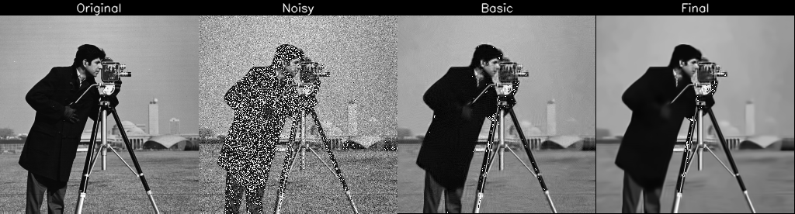  
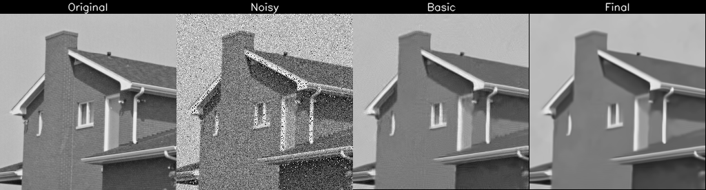  
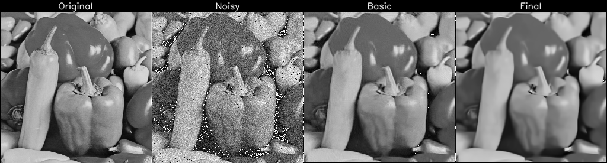  
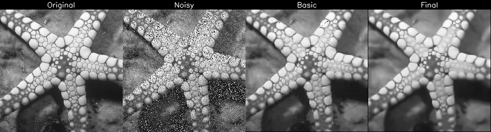  
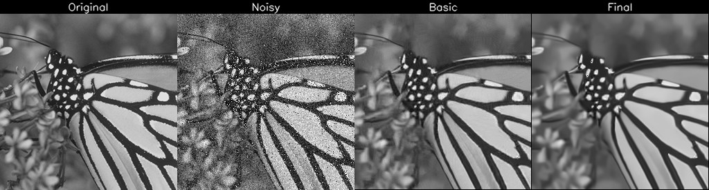  
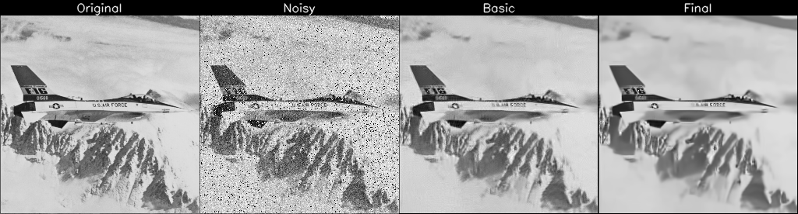  
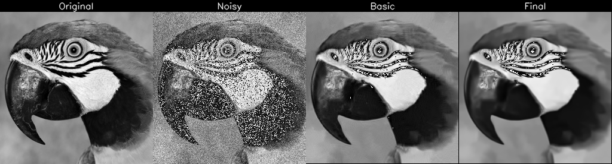  
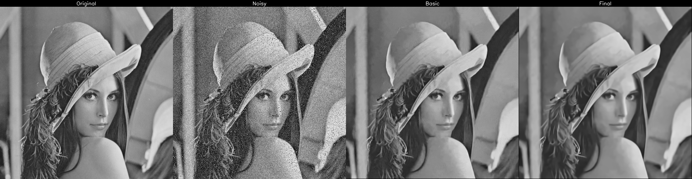  
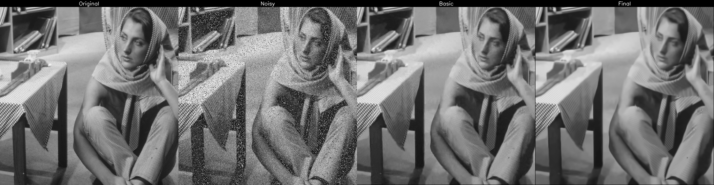  
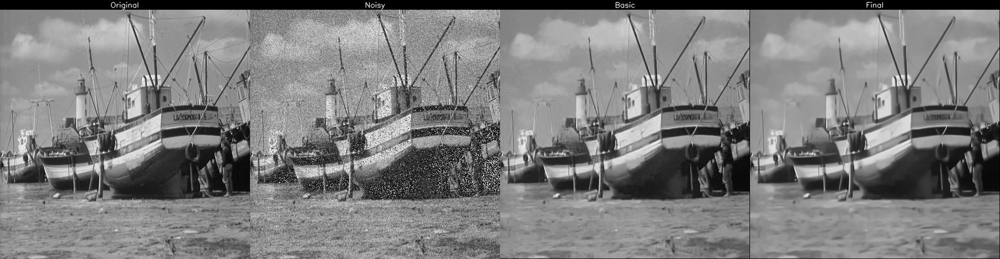  
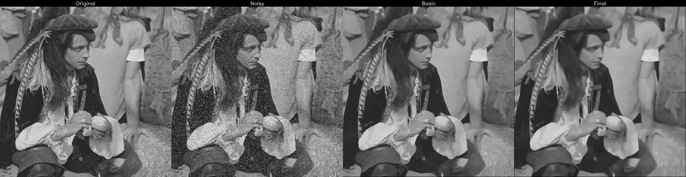  
  

---

| 圖片 idx | Basic PSNR (dB) | Final PSNR (dB) |
|----------|------------------|------------------|
| 01       | 24.9474                 | 24.6204                 |
| 02       | 25.9562                 | 25.7822                 |
| 03       | 23.6753                 | 23.4444                 |
| 04       | 25.2796                 | 24.5963                 |
| 05       | 24.1753                 | 23.7361                 |
| 06       | 23.2833                 | 22.9160                 |
| 07       | 23.9854                 | 23.7361                 |
| 08       | 27.4864                 | 27.1624                 |
| 09       | 27.7512                 | 26.8854                 |
| 10       | 26.7699                 | 26.1557                 |
| 11       | 26.8712                 | 26.1734                 |
| 12       | 25.6524                 | 25.1310                 |

---

## 錯誤紀錄

- cv2 的DCT看起來比scipy的簡單，可以自覺判定2D或者1D的型別，但接受的格式是float32所以不能直接替換使用  
- cv2.idct() 要求 shape 為 (N, 1)
- pycharm 在tqdm 雙迴圈使用的時候，在console區域的顯示會因為設定關係無法使用leave=False 逐行更新

| 類型/物件                     | Reference 傳遞 | 修改是否會影響外部 |
| ------------------------- | ------------ | --------- |
| `int`, `float`, `str`     | ✅ 是          | ❌ 不會      |
| `list`, `dict`, `ndarray` | ✅ 是          | ✅ 會       |
| 自訂 class 物件               | ✅ 是          | ✅ 會       |
