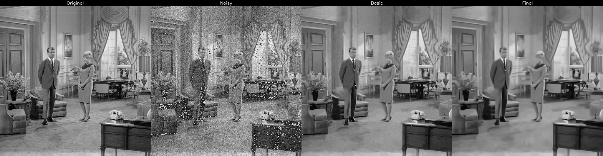

# 測試紀錄與理解整理：BM3D

## 參考資料

[CSDN - BM3D 图像降噪算法与 Python 实现](https://blog.csdn.net/edvard_hua/article/details/130701681)
[Github - ChihaoZhang/BM3D](https://github.com/ChihaoZhang/BM3D/tree/master)
[IPOL - An Analysis and Implementation of the BM3D Image Denoising Method](https://www.ipol.im/pub/art/2012/l-bm3d/article.pdf)
[DnCNN-PyTorch GitHub](https://github.com/SaoYan/DnCNN-PyTorch/tree/master)  

---

## 圖片展示（橫向排列：原圖／加噪／一階段basic estimate／二階段fianl）

  
  
  
  
  
  
  
  
  
  
  
  

---
