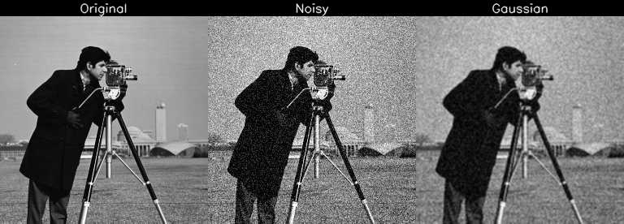
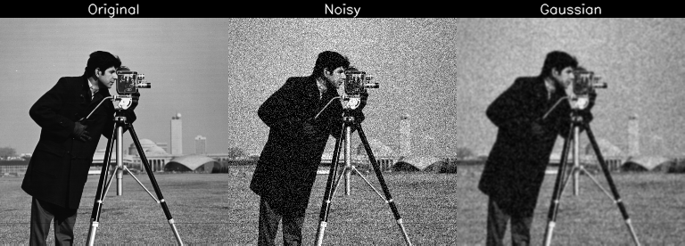
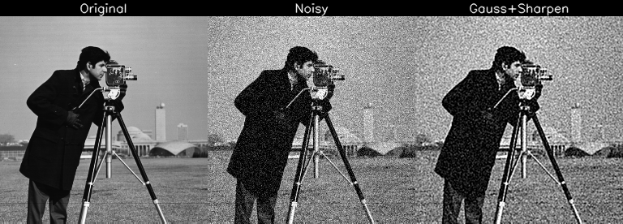

# 測試紀錄與理解整理：DnCNN-PyTorch

## 🔗 資料來源

- 使用程式： [DnCNN-PyTorch GitHub](https://github.com/SaoYan/DnCNN-PyTorch/tree/master)  
- 論文來源： [Beyond a Gaussian Denoiser: Residual Learning of Deep CNN for Image Denoising](https://arxiv.org/pdf/1608.03981)

---

## 📌 我的理解

- DnCNN 在 PSNR 評估上明顯優於傳統去噪技術。
- 模型核心設計為預測雜訊 而非直接預測原圖，目標更聚焦，訓練更穩定。
- 不依賴先驗知識與手工設計，因而具有更好的泛化能力。
- 訓練時圖片會被切成 patch（而非測試時），這有助於增強訓練樣本多樣性與收斂效率。
- 此方法可廣泛應用於：
  
  - SISR（單影像超解析度）
  - 去偽影（artifact removal）
  - 高斯雜訊去除（Gaussian denoising）
  - 盲噪（blind denoising）等問題。

- 幾種傳統方法明顯弱於DnCNN效果
- 銳化有助於人體清晰度感覺，但對PSNR來說反而是傷的

---

## DnCNN核心概念簡述

- 採用 VGG 式堆疊小卷積（3×3），不使用池化層以保留解析度。
- 引入 Batch Normalization 穩定訓練並加速收斂。
- 使用殘差學習，直接預測雜訊以簡化學習目標。
- 以固定大小 patch 進行訓練，提高樣本多樣性並避免過擬合。
- 模型可泛化應用於去雜訊、去偽影、盲噪與單影像超解析度等任務。

---

## 🧪 測試紀錄與觀察

- 我對原始 `test.py` 進行改寫，新增了「原圖 / 加噪 / 去噪」對比圖片輸出功能。
- 由於本地設備效能有限，我只訓練了 **1 個 epoch**。
- 訓練過程中在 **第 300~400 batch** 左右，loss 開始趨於穩定，**PSNR 也穩定在 28以上**。
- 原始程式前幾個 epoch 使用固定學習率 `lr=0.001`，實際上若能更早調降學習率將有助於收斂。

---

## 🖼️ 圖片展示（橫向排列：原圖／加噪／去噪）

### CnDNN

| 資料夾名稱       | 使用參數           | 平均 PSNR     |
|------------------|--------------------|---------------|
| demo_DnCNN-S-15  | DnCNN-S-15 模型參數 | 32.812982     |
| demo_1epoch      | 訓練 1 epoch 的參數 | 30.626433     |

### 傳統方法

| 處理方法                     | PSNR        | 原理簡述                                                                 |
|-----------------------------|-------------|--------------------------------------------------------------------------|
| Wiener 3×3                  | 26.580558   | 自適應濾波器，根據區域統計特性降低噪聲，保留邊緣                       |
| Wiener 7×7                  | 25.927358   | 同上，較大區域平滑效果強，但可能損失細節                               |
| Mean 3×3                    | 25.844596   | 均值濾波，對每個像素取鄰域平均值，去噪力弱，邊緣模糊                    |
| Mean 7×7                    | 23.265147   | 大範圍均值濾波，強力去噪但嚴重模糊圖像                                 |
| Gaussian 3×3                | 26.341389   | 以高斯權重平滑圖像，保留部分邊緣，去噪與保邊平衡                        |
| Gaussian 7×7                | 26.349623   | 更大核，略提升平滑但差異不大，因高斯權重集中於中心                     |
| Gaussian 3×3 + Sharpen（異常）| 20.198921   | 模糊後直接銳化，強化雜訊導致 PSNR 降低                                 |
| Gaussian 7×7 + Sharpen（正常）| 26.233786   | 適度銳化後仍維持原圖接近性，PSNR 僅略低於原 Gaussian                   |

python test_wiener.py --kernel_size 3  
python test_wiener.py --kernel_size 7  
python testfor_mean.py --kernel_size 3  
python testfor_mean.py --kernel_size 7  
python testfor_gaussian.py --kernel_size 3  
python testfor_gaussian.py --kernel_size 7  
python testfor_gaussian_sharpen.py --kernel_size 3  
python testfor_gaussian_sharpen.py --kernel_size 7  

### DnCNN

DnCNN-S-15  
  
1epoch  
  

### 傳統作法

demo_wiener3x3  
  
demo_wiener7x7  
  
demo_mean3x3  
  
demo_mean7x7  
  
demo_gaussian3x3  
  
demo_gaussian7x7  
  
demo_gaussian3x3_sharpen_bad  
  
demo_gaussian3x3_sharpen_good  
  

- `logs` 資料夾中包含：
  - 第一個 epoch 訓練過程中每個 batch 的 `loss` 與 `PSNR` 記錄（txt 格式）
  - 以及繪製的對應圖表（`loss` / `PSNR` 對 batch 的變化圖）
 

  
  

---

## 錯誤紀錄

test_*.py 或 *_test.py 的檔案會被 PyCharm 或 pytest 自動當作測試檔案處理  
使用的時候記得避開命名  
 
