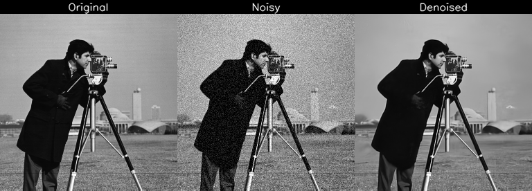
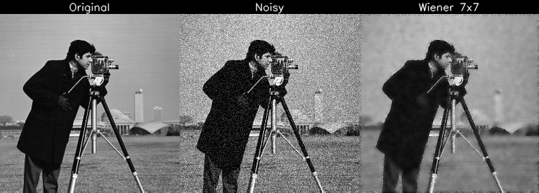
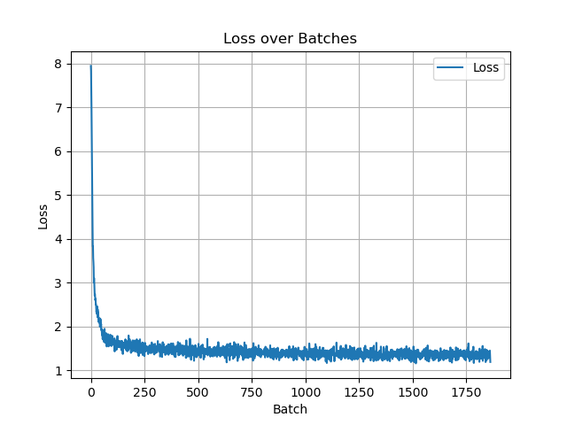
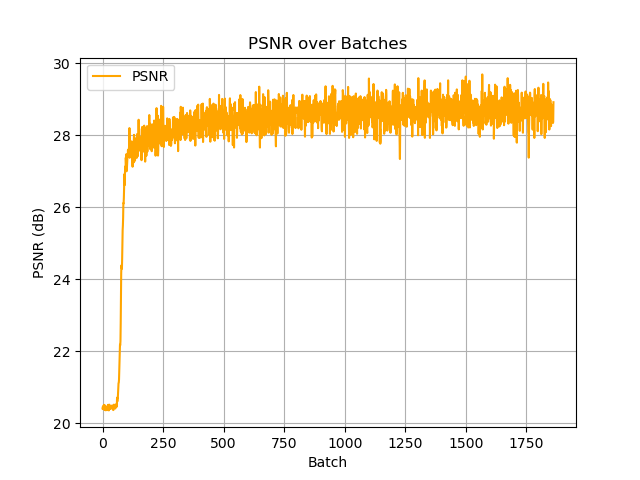

# 測試紀錄與理解整理：DnCNN-PyTorch

## 🔗 資料來源

- 使用程式： [DnCNN-PyTorch GitHub](https://github.com/SaoYan/DnCNN-PyTorch/tree/master)  
- 論文來源： [Beyond a Gaussian Denoiser: Residual Learning of Deep CNN for Image Denoising](https://arxiv.org/pdf/1608.03981)

---

## 📌 我的理解

- **DnCNN 在 PSNR 評估上明顯優於傳統去噪技術**。
- **模型核心設計為預測雜訊** 而非直接預測原圖，目標更聚焦，訓練更穩定。  
- **不依賴先驗知識與手工設計**，因而具有更好的泛化能力。  
- **訓練時圖片會被切成 patch**（而非測試時），這有助於增強訓練樣本多樣性與收斂效率。  
- 此方法可廣泛應用於：
  - SISR（單影像超解析度）
  - 去偽影（artifact removal）
  - 高斯雜訊去除（Gaussian denoising）
  - 盲噪（blind denoising）等問題。

---

## 🧪 測試紀錄與觀察

- 我對原始 `test.py` 進行改寫，新增了「原圖 / 加噪 / 去噪」對比圖片輸出功能。
- 由於本地設備效能有限，我只訓練了 **1 個 epoch**。
- 訓練過程中在 **第 300~400 batch** 左右，loss 開始趨於穩定，**PSNR 也穩定在 28以上**。
- 原始程式前幾個 epoch 使用固定學習率 `lr=0.001`，實際上若能更早調降學習率將有助於收斂。

---

## 🖼️ 圖片展示（橫向排列：原圖／加噪／去噪）

| 資料夾名稱       | 使用參數           | 平均 PSNR     |
|------------------|--------------------|---------------|
| demo_DnCNN-S-15  | DnCNN-S-15 模型參數 | 32.812982     |
| demo_1epoch      | 訓練 1 epoch 的參數 | 30.626433     |

Wiener 3x3 26.580558
Wiener 7x7 25.927358

python test_wiener.py --kernel_size 3
python test_wiener.py --kernel_size 7

DnCNN-S-15  
  
1epoch  
  

傳統作法
demo_wiener3x3  
  
demo_wiener7x7  
  

- `logs` 資料夾中包含：
  - 第一個 epoch 訓練過程中每個 batch 的 `loss` 與 `PSNR` 記錄（txt 格式）
  - 以及繪製的對應圖表（`loss` / `PSNR` 對 batch 的變化圖）
 

  
  

---

## 錯誤紀錄

test_*.py 或 *_test.py 的檔案會被 PyCharm 或 pytest 自動當作測試檔案處理  
使用的時候記得避開命名  
 
